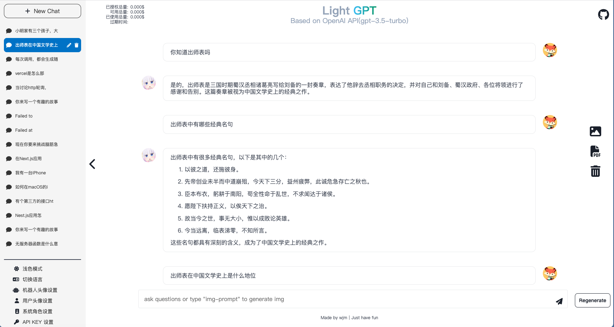
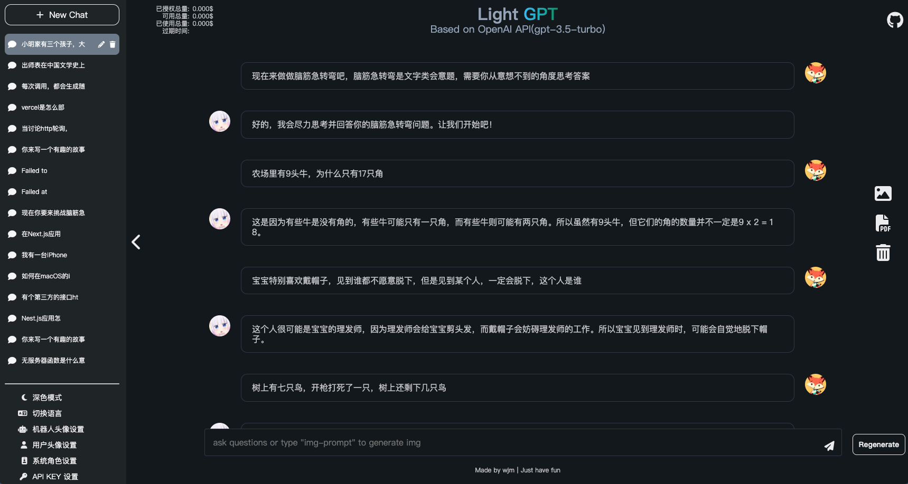

# Light-GPT

Light-GPT is an interactive website project based on the GPT-3.5-Turbo model. It is built using the Next.js framework and deployed on the Vercel cloud platform. It is a pure front-end lightweight application.

Github: https://github.com/KrisCryptoSavoie

Demo: https://light-gpt.vercel.app

## Features

1. A pure front-end application based on the GPT-3.5-Turbo model, using API KEY to request OpenAI's dialogue interface in the front-end, supporting streaming data, and displaying robot replies on the webpage in a typewriter effect.
2. After deployment, users can set their API KEY on the front-end page. With scientific internet access, the Q&A speed will be very fast. The user's API KEY will be saved on the client-side, which means there is no risk of leakage.
3. Supports new thematic dialogues and viewing of historical thematic dialogues. All dialogue data is stored in the IndexedDB of the browser, which means that dialogue data records are saved locally and there is no risk of data leakage.
4. AI replies to programming-related questions support multiple syntax highlighting and one-click code copying.
   Dialogues support image export and PDF export.
5. The application is adapted for both PC and mobile devices, making it convenient to use.
6. DIY, supporting setting user avatars and AI avatars.
7. Support generating images based on text.

## Site Preview





## Local Deployment

To deploy Light-GPT locally, follow these steps (requires node16 or higher):

1. Download the project to your local machine:

```bash
git clone https://github.com/KrisCryptoSavoie.git
```

2. Navigate to the project directory and install dependencies:

```bash
cd light-gpt
pnpm install
```

3. Start the application:

```bash
pnpm run dev
```

The project will now be available for preview at http://localhost:3000. Enter your API KEY on the front-end page to start chatting.

## Vercel Online Deployment

To deploy Light-GPT on Vercel's cloud platform:

1. Register for a Vercel account at [Vercel](https://vercel.com). A mobile verification code is required.

2. Fork the [light-gpt](https://github.com/KrisCryptoSavoie) repository to your own Github account.

3. Log in to the Vercel platform, click "Add New", select "Project", and then import the Github project you just forked. Click "Deploy".

## Docker Local Deployment

For those who prefer to use Docker for local deployment:

1. Pull the Docker image:

```bash
docker pull whynotisme/light-gpt
```

2. Run the image and map port 8080 to port 80:

```bash
docker run -p 8080:80 whynotisme/light-gpt
```
